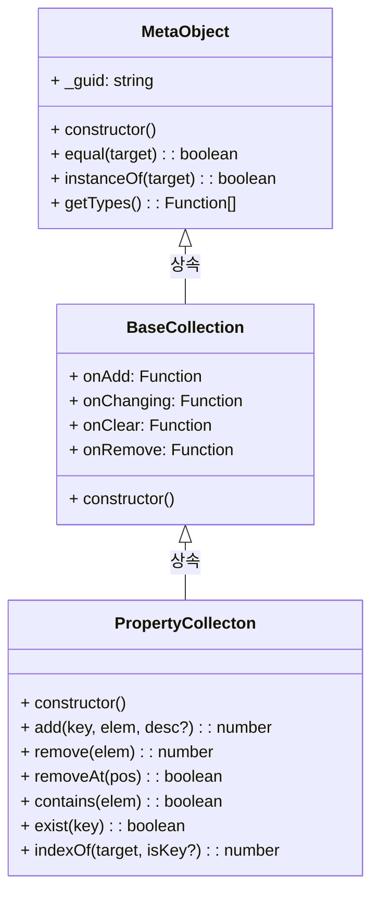

# 주요 구조

## 상속 관계

클래스 다이어그램



---

# 주요 요소

## 속성

| 항목         | 설명                                 |
| ---------- | ---------------------------------- |
| count      | 컬렉션 요소의 갯수입니다.                     |
| _owner     | 컬렉션 소유자입니다.                        |
| _elemTypes | 컬렉션 요소의 타입 제약조건입니다.                |
| _list      | 컬렉션 요소의 목록입니다.                     |
| _guid      | 객체의 고유 식별자 (GUID). 객체를 고유하게 식별합니다. |
| _type      | 객체의 생성자 함수. 객체가 생성될 때 사용된 함수입니다.   |
|            |                                    |


---

## 메소드

| 항목                       |                                          |
| ------------------------ | ---------------------------------------- |
| add(key, elem, desc)     | 프로퍼티 컬렉션에 요소를 추가합니다.                     |
| clear()                  | 프로퍼티 컬렉션을 초기화합니다.                        |
| keyOf(idx)               | 프로퍼티 컬렉션의 인덱스에 해당하는 키를 반환합니다.            |
| exist(key)               | 프로퍼티 컬렉션에 지정된 키가 존재하는지 확인합니다.            |
| remove(elem)             | 컬렉션에 요소를 삭제합니다.                          |
| removeAt(pos)            | 컬렉션에서 지정된 위치의 요소를 삭제합니다.                 |
| contains(elem)           | 요소가 컬렉션에 존재하는지 확인합니다.                    |
| indexOf(target, isKey)   | 프로퍼티 컬렉션에서 지정된 키 또는 요소의 인덱스를 반환합니다.      |
| getObject(vOpt, owned)   | 프로퍼티 컬렉션 객체를 직렬화된 객체로 반환합니다.             |
| setObject(oGuid, origin) | 직렬화된 객체를 사용하여 프로퍼티 컬렉션 객체를 초기화합니다.       |
| equal(target)            | 현재 객체와 지정된 객체가 동일한지 비교합니다.               |
| getTypes()               | 현재 객체의 생성자와 프로토타입 체인의 모든 생성자를 배열로 반환합니다. |
| instanceOf(target)       | 현재 객체가 지정된 타입의 인스턴스인지 확인합니다. (_UNION 포함) |
|                          |                                          |


---
## 이벤트

| 항목         | 설명                            |
| ---------- | ----------------------------- |
| onAdd      | 컬렉션 요소를 추가 전에 발생하는 이벤트 입니다.   |
| onAdded    | 컬렉션 요소를 추가한 후에 발생하는 이벤트입니다.   |
| onRemove   | 컬렉션 요소를 삭제하기 전에 발생하는 이벤트입니다.  |
| onRemoved  | 컬렉션 요소를 삭제한 후에 발생하는 이벤트입니다.   |
| onClear    | 컬렉션을 초기화하기 전에 발생하는 이벤트입니다.    |
| onCleared  | 컬렉션을 초기화한 후에 발생하는 이벤트입니다.     |
| onChanging | 컬렉션 요소를 변경하기 전에 발생하는 이벤트 입니다. |
| onChanged  | 컬렉션 요소를 변경한 후에 발생하는 이벤트 입니다.  |
|            |                               |


---

# 세부 설명

## 주요 속성

### count

> 현재 컬렉션의 요소 수를 반환합니다.

```ts
readonly type count = number;
```

### \_owner

> 컬렉션의 소유 객체입니다.

```ts
type _owner = object;
```

### \_elemTypes

> 컬렉션 요소의 타입 제약조건을 정의합니다.

```ts
type _elemTypes = any[];
```

### \_list

> 컬렉션의 요소 목록을 저장하는 배열입니다. 이 배열은 컬렉션의 실제 데이터를 포함합니다.

```ts
readonly type _list = any[];
```

### \_guid

> 객체의 고유 식별자 (GUID). 객체를 고유하게 식별합니다.

```ts
type _guid = string;
```

### \_type

> 객체의 생성자 함수입니다. 객체가 생성될 때 사용된 함수입니다.

```ts
type _type = Function;
```

---
## 주요 메소드

### add()

> 프로퍼티 컬렉션에 요소를 추가합니다.

```ts
type add = (key: string, elem: any, desc?: PropertyDescriptor) => number;
```
- key : key 요소의 키입니다.
- elem : 추가할 요소입니다.
- desc : 요소에 대한 프로퍼티 기술자 객체입니다. 선택값입니다.
- return : 추가된 요소의 인덱스입니다.
### clear()

> 프로퍼티 컬렉션을 초기화합니다.
> 이 메서드는 `$elements`, `$descriptors`, `$keys` 배열을 초기화합니다.
> 이벤트는 초기화되지 않습니다.

```ts
type clear = () => void;
```

#### 예제
```js
myCollection.clear();
console.log(myCollection.count); // 0
```

### keyOf()

> 프로퍼티 컬렉션의 인덱스에 해당하는 키를 반환합니다.

```ts
type keyOf = (idx: number) => string;
```
- idx : 조회할 인덱스 값입니다.
- return : 인덱스에 해당하는 키입니다. 인덱스가 범위를 벗어나면 `undefined`를 반환할 수 있습니다.

#### 예제
```js
const key = myCollection.keyOf(0);
console.log(`인덱스 0의 키: ${key}`);
```

### exist()

> 프로퍼티 컬렉션에 지정된 키가 존재하는지 확인합니다.

```ts
type exist = (key: string) => boolean;
```
- key - 확인할 키입니다.
- return : 키의 존재 여부를 나타내는 불리언 값입니다.

### remove()

> 컬렉션에 요소를 삭제합니다.

```ts
type remove = (elem: any) => number;
```
- elem : 삭제할 요소입니다.
- return : 삭제된 요소의 인덱스입니다.

#### 예제
```js
const removedIndex = myCollection.remove(someElement);
console.log(`삭제된 요소의 인덱스: ${removedIndex}`);
```

### removeAt()

> 컬렉션에서 지정된 위치의 요소를 삭제합니다.

```ts
type removeAt = (pos: number) => boolean;
```
- pos : 삭제할 요소의 인덱스입니다.
- return : 요소 삭제 성공 여부를 나타내는 불리언 값입니다.

#### 예제
```js
const success = myCollection.removeAt(0);
console.log(`요소 삭제 성공: ${success}`);
```

### contains()

> 요소가 컬렉션에 존재하는지 확인합니다.

```ts
type contains = (elem) => boolean;
```
- elem : 확인할 요소입니다.
- return : 요소의 존재 여부를 나타내는 불리언 값입니다.
#### 예제
```js
const exists = myCollection.contains(someElement);
console.log(`요소 존재 여부: ${exists}`);
```

### indexOf()

> 프로퍼티 컬렉션에서 지정된 키 또는 요소의 인덱스를 반환합니다.

```ts
type indexOf = (target: any | string, isKey?: boolean) => number;
```
- target : target 조회할 키 또는 요소입니다. 키로 조회할 경우 문자열을 전달할 수 있습니다.
- isKey : 키로 조회할지 여부를 결정하는 불리언 값입니다. 기본값은 `false`입니다.
- return : 요소의 인덱스입니다. 요소가 존재하지 않을 경우 `-1`을 반환합니다.

#### 예제
```js
const index = myCollection.indexOf("key1", true);
console.log(`키의 인덱스: ${index}`);
```

---
## 주요 이벤트

### onAdd

> 컬렉션에 요소를 추가하기 전에 발생하는 이벤트입니다.

```ts
type onAdd = (idx: number, elem: any, _this: object) => void;
```
- idx : 추가할 요소의 인덱스입니다.
- elem : 추가할 요소입니다.
- \_this : 현재 컬렉션 객체입니다.
#### 예제
```js
myCollection.onAdd = function(idx, elem, _this) {
	console.log(`요소 추가 전: 인덱스 ${idx}, 요소 ${elem}`);
};
```

### onAdded

> 컬렉션에 요소를 추가한 후에 발생하는 이벤트입니다.

```ts
type onAdded = (idx: number, elem: any, _this: object) => void;
```
- idx : 추가된 요소의 인덱스입니다.
- elem : 추가된 요소입니다.
- \_this : 현재 컬렉션 객체입니다.

#### 예제
```js
myCollection.onAdded = function(idx, elem, _this) {
	console.log(`요소 추가 후: 인덱스 ${idx}, 요소 ${elem}`);
};
```

### onRemove

> 컬렉션에서 요소를 삭제하기 전에 발생하는 이벤트입니다.

```ts
type onRemove = (idx: number, elem: any, _this: object) => void;
```
- idx : 삭제할 요소의 인덱스입니다.
- elem : 삭제할 요소입니다.
- \_this : 현재 컬렉션 객체입니다.
#### 예제
```js
myCollection.onRemove = function(idx, elem, _this) {
	console.log(`요소 삭제 전: 인덱스 ${idx}, 요소 ${elem}`);
};
```

### onRemoved

> 컬렉션에서 요소를 삭제한 후에 발생하는 이벤트입니다.

```ts
type onRemoved = (idx: number, elem: any, _this: object) => void;
```
- idx : 삭제된 요소의 인덱스입니다.
- elem : 삭제된 요소입니다.
- \_this : 현재 컬렉션 객체입니다.

#### 예제
```js
myCollection.onRemoved = function(idx, elem, _this) {
	console.log(`요소 삭제 후: 인덱스 ${idx}, 요소 ${elem}`);
};
```

### onClear

> 컬렉션을 초기화하기 전에 발생하는 이벤트입니다.

```ts
type onClear = (_this: object) => {};
```
- \_this : 현재 컬렉션 객체입니다.

#### 예제
```js
myCollection.onClear = function(_this) {
	console.log('컬렉션 초기화 전');
};
```

### onCleared

> 컬렉션을 초기화한 후에 발생하는 이벤트입니다.

```ts
type onCleared = (_this: object)=> {};
```
- \_this : 현재 컬렉션 객체입니다.

#### 예제
```js
myCollection.onCleared = function(_this) {
	console.log('컬렉션 초기화 후');
};
```

### onChanging

> 컬렉션의 요소를 변경하기 전에 발생하는 이벤트입니다.

```ts
type onChanging = (idx: number, elem: any, _this: object) => void;
```
- idx : 변경할 요소의 인덱스입니다.
- elem : 변경할 요소입니다.
- \_this : 현재 컬렉션 객체입니다.

#### 예제
```js
myCollection.onChanging = function(idx, elem, _this) {
	console.log(`요소 변경 전: 인덱스 ${idx}, 요소 ${elem}`);
};
```

### onChanged

> 컬렉션의 요소를 변경한 후에 발생하는 이벤트입니다.

```ts
type onChanged = (idx: number, elem: any, _this: object) => void;
```
- idx : 변경된 요소의 인덱스입니다.
- elem : 변경된 요소입니다.
- \_this : 현재 컬렉션 객체입니다.

#### 예제
```js
myCollection.onChanged = function(idx, elem, _this) {
	console.log(`요소 변경 후: 인덱스 ${idx}, 요소 ${elem}`);
};
```

---