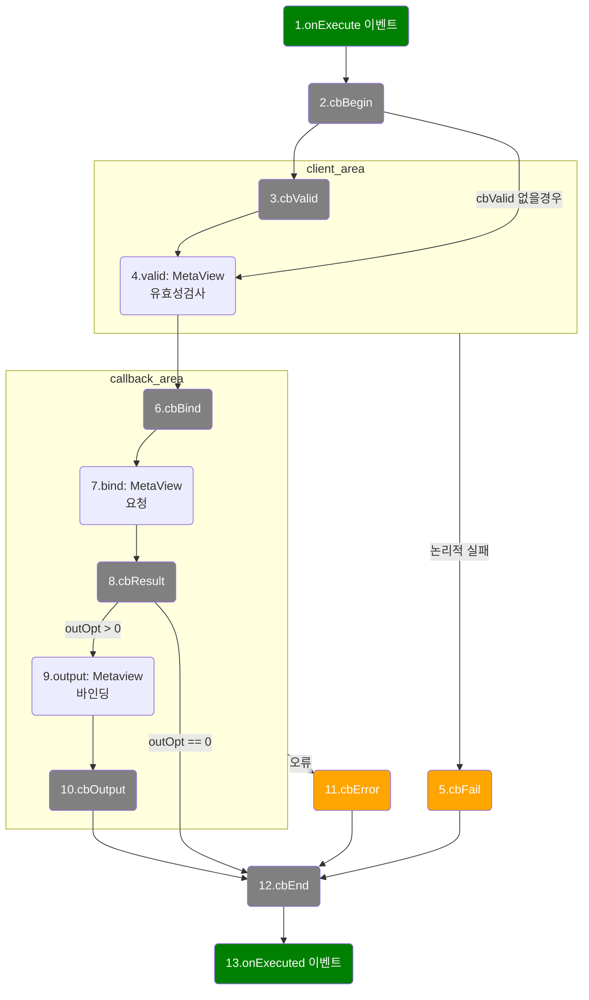

### execute() 라이프 사이클

1. `onExecute` 이벤트는 execute() 메소드 실행시 처음으로 호출되는 이벤트입니다.
2. `cbBegin` 콜백은 처음으로 호출됩니다. 초기값 설정하는데 활용됩니다.
3. `cbValid` 콜백은 valid(MetaView) 에 대한 유효성 검사전에 호출합니다. 
   활용 : 삭제전 confirm() 에 활용, 사용자 유효성 검사
4.  valid(MetaView)의 columns 의 유효성 검사를 합니다. column.valid(value)
5.  `cbFail` 콜백은 논리적인 실패를 처리합니다.
6. `cbBind` 콜백은 http 전송 스타일을 제어하여 특별한 처리에 활용합니다. (이미지, 통합로그인)
7. bind(MetaView)은 bind.columns 을 http 서버에 요청합니다.
8. `cbResult` 콜백은 response 결과에 대한 가공에 활용합니다.
9. outputOption 에 따라서 output(MetaView)에 데이터 및 값을 바인딩 합니다.
10. `cbOutput` 콜백은 response 결과 또는 output 으로 html 과 같이 출력 관련된 처리를 합니다.
11. `cbError` 콜백은 cbBind 이후의 오류 또는 예외 발생시 호출합니다.
12. `cbEnd` 콜백은 마지막에 호출합니다.
    활용 : 리다렉트, 성공 메세지, 다른 command.exetue() 체인 연결
13. `onExecuted` 이벤트는 execute() 메소드 실행시 마지막으로 호출되는 이벤트입니다.